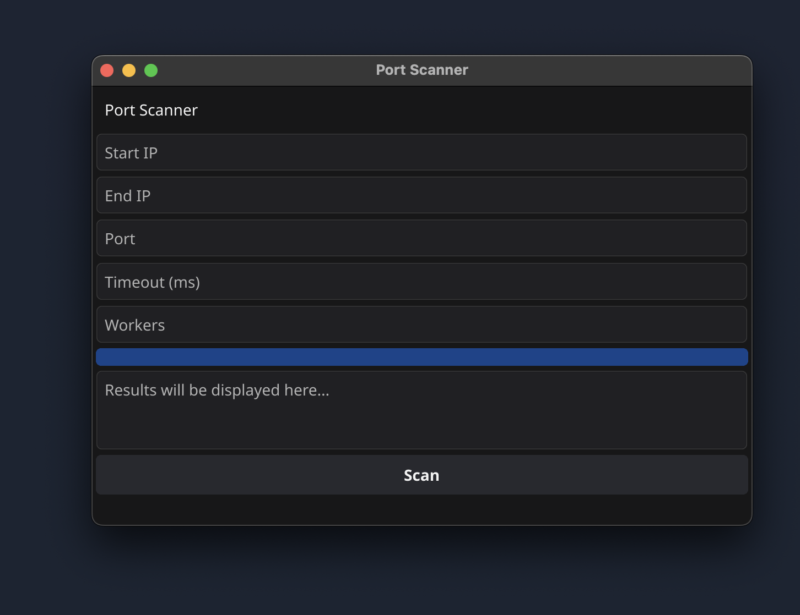
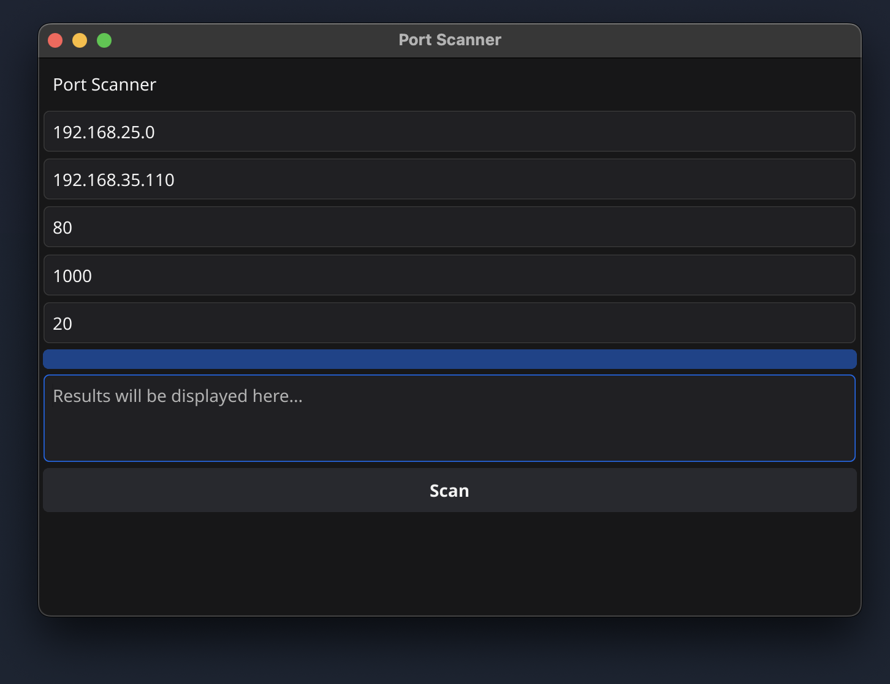
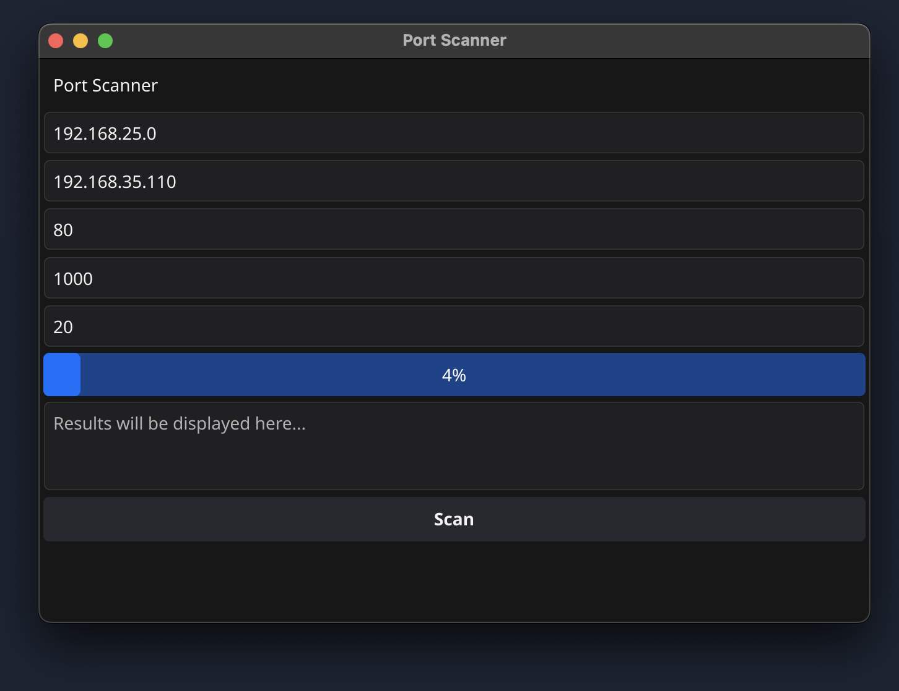
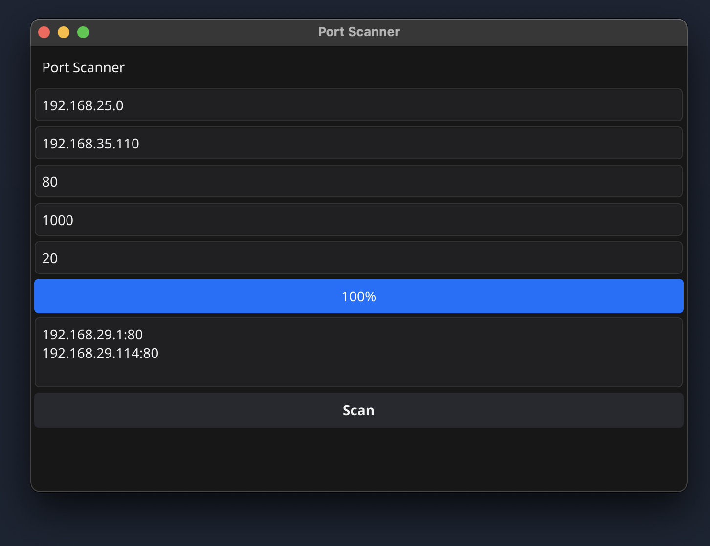

# Basic IP Scanner
Wrote to find the IP of CCTV server without installing any third party application, integrated the UI for easy operations.

- `go run src/main.go`

## Motivation
- Wanted to find out IP broadcasted by locally setup CCTV server

## Samples

